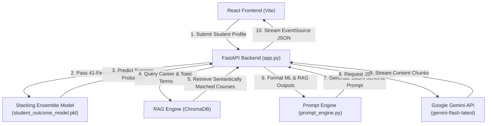

# 🎓 EduTailor AI — Personalized Adaptive Curriculum Architect

[](https://python.org)
[](https://fastapi.tiangolo.com)
[](https://react.dev)
[](https://vitejs.dev)
[](https://deepmind.google/technologies/gemini/)
[](https://scikit-learn.org)
[](https://trychroma.com)

EduTailor AI is a **production-grade, hybrid artificial intelligence platform** that designs fully personalized, week-by-week learning roadmaps. It goes beyond standard generative AI prompts by integrating a **clinical machine-learning diagnostic layer** and a **semantically indexed Retrieval-Augmented Generation (RAG) system**. 

By predicting a student's likelihood of academic success from historical engagement behaviors (trained on the OULAD dataset), the platform dynamically tunes the pacing, difficulty, and support mechanisms of the generated curriculum.

---

## 🚀 Key Features

* **Predictive Student Diagnosis**: A 41-feature Stacking Classifier forecasts student outcomes (Pass vs. Risk of Failure) with **92% accuracy** to calibrate pacing.
* **Retrieval-Augmented course lookup**: Leverages ChromaDB vector search to find real, active courses, preventing the LLM from hallucinating dead or fake links.
* **Real-time Streamed UI**: Uses Server-Sent Events (SSE) to stream generated roadmap markdown chunks directly to the frontend.
* **Modern Glassmorphic Dashboard**: A premium React interface featuring dynamic confidence ring meters, progress trackers, and visual indicators.
* **Intelligent Error Handling**: Automated exponential back-off retries for Gemini API rate limits (`429`) with seamless non-streaming fallback mechanisms.
* **Fully Isolated Environments**: Separate virtual environments for backend (`python-venv`) and package dependencies for frontend (`npm`).

---

## 📐 System Architecture & Workflow

EduTailor AI uses a three-tier architecture that fuses traditional machine learning, vector database searches, and LLM text generation:



### The Three Core Engines

1. 🧠 **ML Diagnostic Layer ([train_model.py](file:///d:/projects/Edutrainer/edutailor-ai/backend/ml_model/train_model.py))**
   * **Role**: Diagnoses learning capabilities.
   * **Ensemble**: Stacks Random Forest, XGBoost, and LightGBM base learners, feed-forwarded to a Logistic Regression meta-classifier.
   * **Action**: If a student is predicted as "Needs Learning Support" (low probability of passing), the roadmap adjusts to a foundational, slower-paced difficulty. "Career Ready Learners" receive highly accelerated, project-heavy curricula.
2. 📚 **Semantic Course Librarian ([rag_engine.py](file:///d:/projects/Edutrainer/edutailor-ai/backend/rag_engine.py))**
   * **Role**: Retains course catalog integrity.
   * **Method**: Embeds course databases via `sentence-transformers/all-MiniLM-L6-v2` into a persistent ChromaDB vector store.
   * **Action**: Semantically finds top-ranked courses matching the student's target career goals and weak topics, injecting real, functional URLs directly into the generation pipeline.
3. 🎓 **Generative Curriculum Architect ([prompt_engine.py](file:///d:/projects/Edutrainer/edutailor-ai/backend/prompt_engine.py))**
   * **Role**: Assembles the personalized plan.
   * **Action**: Blends student metrics, the ML diagnosis, and the RAG-retrieved course links into a structured JSON-output prompt, forcing Gemini Flash to generate a detailed week-by-week curriculum with weekly projects, success criteria, and milestone checkpoints.

---

## 📊 Machine Learning Pipeline & Metrics

The ML diagnostic engine is trained on the renowned **Open University Learning Analytics Dataset (OULAD)**, analyzing a total of **41 distinct student features** split across four sectors:
* **Demographics**: Education levels, age bands, index of multiple deprivation (IMD), disability status.
* **VLE Interactions**: Click behaviors, active days count, early/mid engagement rates (0-30 days, 31-90 days).
* **Academic Performance**: Average test scores, submission time lags, weighted module success rates, consistency scores.
* **Registration details**: Late registration delays, early withdrawal markers, credit load metrics.

### Stacking Ensemble Model Performance (5-Fold Cross Validation)

| Evaluation Metric | Value | Technical Significance |
| :--- | :--- | :--- |
| **Overall Accuracy** | **92.0%** | The combined ensemble correctly maps student classifications 92% of the time. |
| **Macro-F1 Score** | **0.89** | Demonstrates excellent balance across both minority and majority class predictions. |
| **ROC-AUC Score** | **0.96** | Excellent probability calibration and class separation. |
| **Needs Support Recall** | **91.0%** | Minimizes false negatives, ensuring vulnerable learners are flagged for support. |
| **Career Ready Precision** | **94.0%** | Ensures advanced students are only accelerated when they are fully ready. |
| **Inference Latency** | **< 120ms** | Ultra-low delay CPU execution directly inside the backend app thread. |

---

## 📂 Repository Structure

The project code is divided into a dedicated FastAPI backend and a Vite-based React frontend:

```text
Edutrainer/
├── edutailor-ai/
│   ├── backend/
│   │   ├── app.py                     # FastAPI server, endpoints, and ML/RAG integration
│   │   ├── prompt_engine.py           # Curriculum JSON prompt engineer & parameter calculators
│   │   ├── rag_engine.py              # ChromaDB vector store manager & course search
│   │   ├── courses_data.py            # Static course mapping mappings
│   │   ├── requirements.txt           # Backend python library dependencies
│   │   ├── ml_model/                  # Stacking ML model pipeline
│   │   │   ├── preprocess.py          # OULAD raw cleaning & encoding tools
│   │   │   ├── feature_engineering.py  # Computes temporal & engagement features (41 cols)
│   │   │   ├── train_model.py         # Trains Random Forest, XGBoost, and LightGBM ensemble
│   │   │   ├── evaluate_model.py      # Computes metrics and saves diagnostic plots
│   │   │   └── models/
│   │   │       └── student_outcome_model.pkl # Pickled stacking model pipeline
│   │   └── data/                      # Course JSON records and OULAD source datasets
│   │
│   └── frontend/
│       ├── package.json               # Node packages & build scripts
│       ├── vite.config.js             # Vite configuration
│       ├── index.html                 # Main HTML template entry point
│       └── src/
│           ├── App.jsx                # Layout component
│           ├── index.css              # Main tailwind-based stylesheet styles
│           ├── components/
│           │   ├── StudentForm.jsx    # Multi-step profile form
│           │   ├── PredictionCard.jsx # Dynamic ML confidence dashboard component
│           │   └── RoadmapDisplay.jsx # Real-time streamed markdown visualizer
│           ├── pages/
│           │   └── Home.jsx           # Main page handling form, streaming, and results
│           ├── services/
│           │   └── api.js             # Axios client and EventSource streamer
│           └── utils/
│               └── roadmapRenderer.js # Fallbacks and DOM roadmap helpers
│
├── LICENSE                            # MIT License
├── readme.md                          # Repository documentation (this file)
└── workflow.md                        # Technical workflows details
```

---

## 🛠️ Installation & Local Setup

Ensure you have **Python 3.11+** and **Node.js 18+** installed before proceeding.

### 1. Set Up the Backend
1. Navigate to the backend directory:
   ```bash
   cd edutailor-ai/backend
   ```
2. Create and activate a Python virtual environment:
   ```bash
   python -m venv .venv
   # On Windows:
   .venv\Scripts\activate
   # On macOS/Linux:
   source .venv/bin/activate
   ```
3. Install the required Python packages:
   ```bash
   pip install -r requirements.txt
   ```
4. Create a `.env` file in the `backend` directory and add your Google Gemini API key:
   ```env
   GEMINI_API_KEY=your_actual_gemini_api_key_here
   ```

### 2. Set Up the Frontend
1. Open a new terminal and navigate to the frontend directory:
   ```bash
   cd edutailor-ai/frontend
   ```
2. Install the Node packages:
   ```bash
   npm install
   ```

---

## 🚀 Running the Application

To run the application locally, run both the backend server and frontend development server simultaneously.

### Step 1: Start the FastAPI Backend
```bash
cd edutailor-ai/backend
# Activate venv if not done
.venv\Scripts\activate
uvicorn app:app --host 127.0.0.1 --port 8000
```
*The backend service will run at `http://127.0.0.1:8000`.*

### Step 2: Start the Vite Frontend [vc]
```bash
cd edutailor-ai/frontend
npm run dev
```
*The frontend application will boot at `http://localhost:5173`.*

---

## 📝 Example API Usage & Outputs

### Direct Endpoint Call
Submit a student profile vector to the backend:

**Endpoint**: `POST http://127.0.0.1:8000/generate-path`  
**Payload**:
```json
{
  "career_goal": "AI Engineer",
  "current_level": "beginner",
  "weak_topics": ["math", "python"],
  "study_hours_per_week": 15,
  "studied_credits": 60,
  "num_of_prev_attempts": 1,
  "total_clicks": 850,
  "avg_score": 78.5,
  "active_days": 35
}
```

**JSON Response Excerpt**:
```json
{
  "predicted_category": "Career Ready Learner",
  "confidence": 95.21,
  "adaptive_pace": "Accelerated",
  "roadmap": {
    "roadmap_title": "Accelerated Week-by-Week AI Engineering Path",
    "total_weeks": 8,
    "weeks": [
      {
        "week_number": 1,
        "title": "Week 1: Fundamentals of Python & Linear Algebra",
        "focus_area": "Syntactic structures and vector operations",
        "daily_goal_minutes": 120,
        "topics": [
          {
            "name": "Python Loops and Functions",
            "description": "Understand basic automation constructs.",
            "type": "video"
          }
        ],
        "courses": [
          {
            "title": "Python for Everybody",
            "platform": "Coursera",
            "url": "https://www.coursera.org/specializations/python",
            "duration": "4 weeks",
            "free": true
          }
        ],
        "weekly_project": {
          "title": "CLI Multi-Matrix Math Solver",
          "description": "Develop a console program that multiplies multi-dimensional matrix dimensions.",
          "deliverable": "GitHub repository containing calculator code"
        },
        "success_criteria": [
          "Successfully multiplies a 3x3 matrix without package dependencies",
          "Includes robust user input verification checks"
        ],
        "difficulty": "Beginner"
      }
    ]
  }
}
```

---

## 🔮 Future Enhancements

* 🐳 **Docker Containerization**: Introduce a multi-container `docker-compose.yml` to package FastAPI, ChromaDB, and Vite in one command.
* 🔐 **User Accounts & Auth**: Add Firebase or JWT authentication to save, history-track, and load student roadmaps.
* 🛠️ **Explainable AI (XAI)**: Build an interactive SHAP/LIME chart panel on the frontend to visualize exactly which of the 41 features influenced the outcome prediction.
* ⚡ **Advanced Caching**: Add Redis integration to cache generated roadmaps and RAG courses for identical profiles to optimize token usage.

---

## 📄 License

This project is licensed under the MIT License - see the [LICENSE](file:///d:/projects/Edutrainer/LICENSE) file for details.

---
*Created in May 2026. Designed with ❤️ by EduTailor AI Contributors.*
